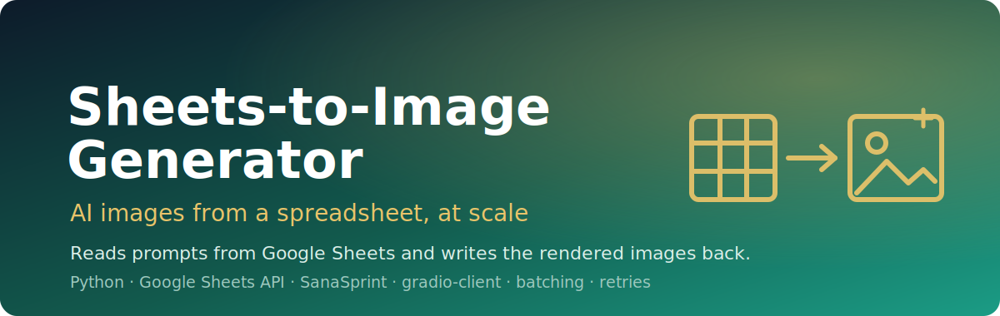

<p align="center">
  
</p>

<h1 align="center">Sheets-to-Image Generator</h1>

<p align="center"><em>Read prompt rows from Google Sheets, render them with a generative image API, and write the results straight back into the sheet.</em></p>

<p align="center">
  
  
  
  
</p>

**Sheets-to-Image Generator** is a **Python** batch tool that turns a Google Sheet into an image pipeline. Each row describes an image — title, style, background, theme — and the system builds a prompt, calls the **SanaSprint** generative image API through **gradio-client**, and writes the resulting image (as a base64 data URL) back into the sheet. It connects via the **Google Sheets API v4** with a service account, processes rows in batches, retries failed calls, skips rows that already have an image, and logs every run.

> Treat a spreadsheet as your image queue: fill in rows, run one command, get rendered images back in the same sheet.

---

## ✨ Features

- **Google Sheets as the data source** — reads prompt rows over the Sheets API v4 and writes generated images back into the output column.
- **Prompt assembly from columns** — combines Content Title, Image Style, Background Color, and Theme Description into a structured prompt, inheriting the last non-blank value when a cell is empty.
- **AI image generation** — calls the SanaSprint model (`Efficient-Large-Model/SanaSprint`) via `gradio_client`, with configurable size, guidance scale, and inference steps.
- **Batch processing** — updates the sheet in configurable batches (default 10 rows) using the Sheets `batchUpdate` API.
- **Retry & error handling** — retries failed generations up to `max_retries` times with a delay between attempts, and marks failed rows in the sheet.
- **Skip-existing** — rows that already contain an image are skipped on re-runs.
- **Detailed logging** — every run writes a timestamped log under `logs/`.
- **Single-row tools** — `test_single_row.py` and `clear_and_retry.py` for processing or re-running one specific row.

## 🏗️ Architecture

The system reads a range of rows, builds a prompt per row, generates an image, and writes the result back in batches.

```
Google Sheet (A:E)                 ImageGenerationSystem                 SanaSprint API
+------------------+   read range   +-----------------------+   prompt   +----------------+
| Title  | Style   | -------------> | _create_prompt()      | ---------> | gradio-client  |
| BgColor| Theme   |   (Sheets v4)  | retry loop / batching | <--------- | /infer endpoint|
| Image (output)   | <------------- | batch_update()        |  data URL  +----------------+
+------------------+  write images  +-----------------------+
```

- `sheets_client.py` — `GoogleSheetsClient`: read range, update cell, batch update.
- `image_generator.py` — `SanaSprintGenerator`: calls the model and converts local results to data URLs.
- `main.py` — `ImageGenerationSystem`: prompt assembly, batching, retries, statistics.
- `cli.py` / `quickstart.py` — entry points (flags/config file vs. guided setup).
- `utils.py` — logging setup, spreadsheet-ID validation, range parsing.

## 🚀 Run it

**1. Install dependencies**

```bash
pip install -r requirements.txt
```

**2. Set up Google Sheets API credentials**

1. In the [Google Cloud Console](https://console.cloud.google.com/), create a project and enable the **Google Sheets API**.
2. Create a **service account**, download its JSON key, and save it as `credentials.json` in the project directory.
3. Share your target sheet with the service account email so it can read and write.

**3. Prepare the sheet**

Your sheet should use these columns (with a header row in row 1):

| A | B | C | D | E |
|---|---|---|---|---|
| Content Title | Image Style | Background Color | Theme Description | Image Generation (output) |

**4. Run**

Guided first run:

```bash
python quickstart.py
```

Or run the CLI directly:

```bash
python cli.py --spreadsheet-id YOUR_SPREADSHEET_ID
```

With more control:

```bash
python cli.py \
  --spreadsheet-id YOUR_SPREADSHEET_ID \
  --sheet-range 'Sheet1!A2:E100' \
  --batch-size 20 \
  --max-retries 5 \
  --retry-delay 10
```

Process or retry a single row:

```bash
python test_single_row.py 2 --force
python clear_and_retry.py 2
```

## 🔧 Config

Configuration can come from environment variables, CLI flags, or a JSON config file (flags override the config file).

**Environment variables**

| Variable | Description |
|----------|-------------|
| `SPREADSHEET_ID` | ID of the Google Sheet to process |
| `SHEET_RANGE` | A1 range to process (e.g. `Sheet1!A2:E100`) |
| `GOOGLE_CREDENTIALS` | Path to the service-account JSON (default `credentials.json`) |

**Config file** (see [`config.sample.json`](config.sample.json)):

```json
{
  "spreadsheet_id": "YOUR_SPREADSHEET_ID",
  "sheet_range": "Sheet1!A2:E100",
  "credentials_file": "credentials.json",
  "batch_size": 10,
  "max_retries": 3,
  "retry_delay": 5,
  "image_generation": {
    "model_size": "1.6B",
    "width": 1024,
    "height": 1024,
    "guidance_scale": 4.5,
    "num_inference_steps": 2,
    "randomize_seed": true
  }
}
```

```bash
python cli.py --config config.json
```

## 🙏 Acknowledgments

- [Google Sheets API](https://developers.google.com/sheets/api)
- [SanaSprint](https://github.com/Efficient-Large-Model/SanaSprint) — the image generation model
- [gradio-client](https://github.com/gradio-app/gradio-client) — API client used to call the model
